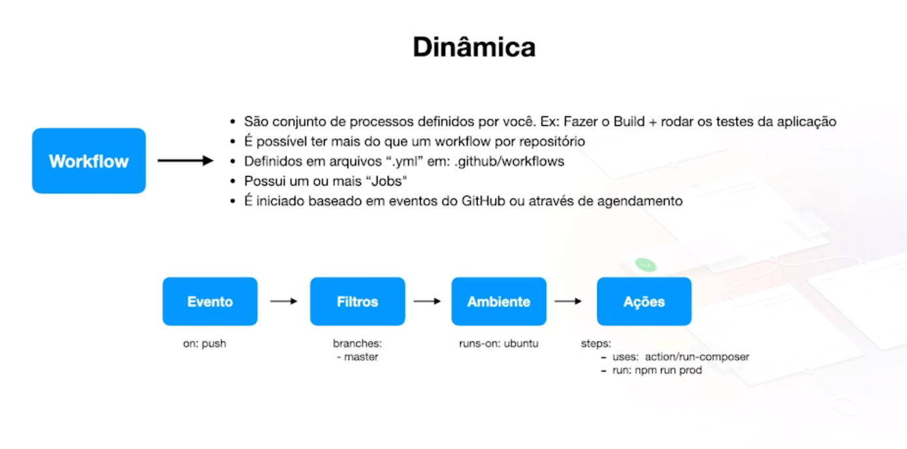

# 23 - Integração continua ou CI(continuos ingregration)

### Repositórios

Projeto: https://github.com/codeedu/fc2.0-ci-go
GitHub Actions: https://github.com/actions/checkout
Documentation: https://github.com/marketplace/actions/build-and-push-docker-images

## Sumário

1. [o que é CI](#o-que-é-ci)
2. [Criando um software exemplo](#criando-um-software-exemplo)

## o que é CI

É o processo de integrar modificações do codebase de forma contínua e automatizada, evitando assim erros humanos de verificação, garantindo mais agilidade e segurança no processo de desenvolvimento de um software.

#### Principais Processos

- Execução de testes
- Linter
- Verificações de qualidade de código
- Verificação de segurança
- Geração de artefatos prontos para o processo de deploy
- Identificação da próxima versão a ser gerada no software
- Geração de tags e releases

#### Status Check

É a garantia de uma Pull Request não poderá ser mergeada ao repositório sem antes ter passado pelo processo de CI ou mesmo no processo de Code Review.

#### Ferramentas populares

- Jenkins
- GitHub Actions
- Circle CI
- AWS Code Build
- Azure Devops
- Google Cloud Build
- GitLab Pipeline / CI

#### O que é o GitHub Actions

O GitHub Actions é um automatizador de workflow de desenvolvimento de software.

Ele utiliza os principais eventos gerados pelo GitHub para que possamos executar tarefas dos mais variados tipos, incluindom processo de CI.

#### Dinâmica

#### Actions

É ação que de fato será executada em um dos Steps de um Job em um Workflow.

Ela pode ser cirada do zero ou ser reutilizada de actions pre-existentes.

### Criando um software exemplo